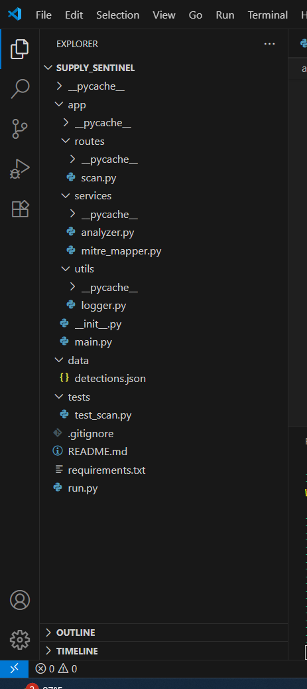
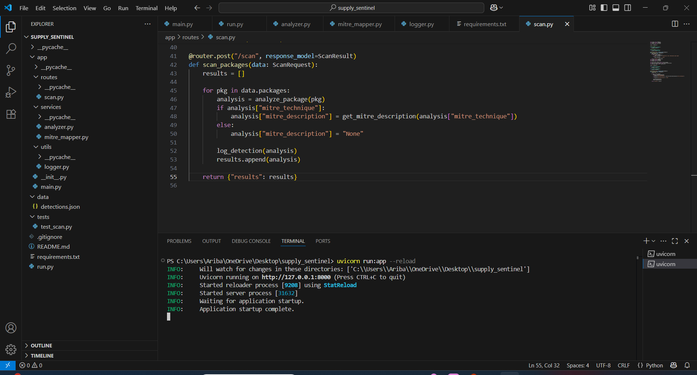
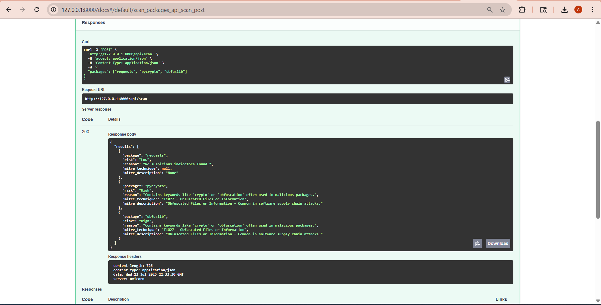
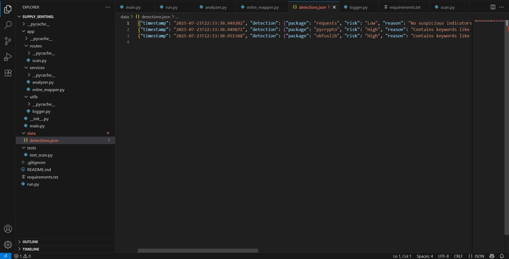
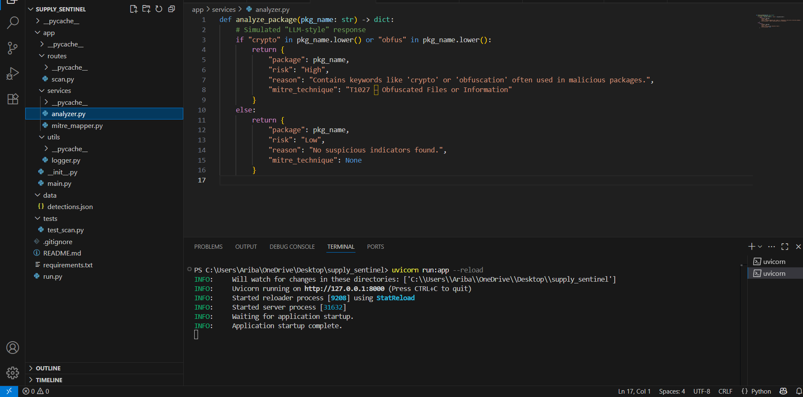
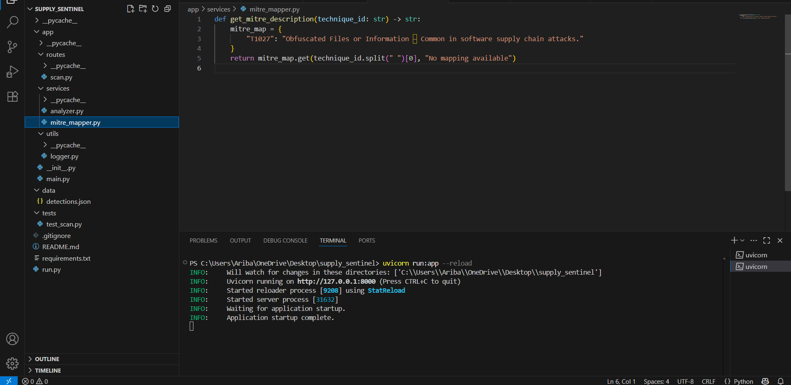

# 🛡️ Supply Sentinel – CI/CD Threat Analyzer

**Supply Sentinel** is an AI-powered cybersecurity tool designed to detect suspicious packages and behaviors during the CI/CD pipeline. It blends static analysis, MITRE ATT&CK mapping, and simulated LLM classification to flag potentially malicious dependencies in real time.

---

## 🚀 Features

- 🔍 Accepts a list of packages for scanning
- 🧠 Simulated LLM-style risk classification
- 🗺️ MITRE ATT&CK mapping for known techniques
- 📄 Auto-logs scan results to a JSON file
- ⚡ Built with FastAPI (fully RESTful)

---

## 📁 Project Structure

supply_sentinel/
├── app/
│ ├── routes/ → API routes (e.g., /scan)
│ ├── services/ → Analysis logic, MITRE mapping
│ └── utils/ → Logger
├── data/ → Output logs (detections.json)
├── screenshots/ → Project screenshots
├── tests/ → Sample test cases
├── run.py → App entrypoint
├── README.md

yaml
Copy
Edit

---

### 📸 Project Walkthrough


### 1. Project Structure  


---

### 2. Server Running  


---

### 3. Swagger UI  


---

### 4. Scan Request (Input)  


---

### 5. Scan Response (Output)  


---

### 6. Log Output  


---

### 7. Detection Logic – analyzer.py  


---

### 8. MITRE Mapping – mitre_mapper.py  



---

## ▶️ How It Works

### 🟢 Step 1: Start the FastAPI Server

```bash
uvicorn run:app --reload
```
### 🌐 Step 2: Visit the Swagger UI

Visit: http://127.0.0.1:8000/docs


### 📤 Step 3: Submit Packages to Scan

Input example:

json
Copy
Edit
{
  "packages": ["requests", "pycrypto", "obfuslib"]
}

### 📥 Step 4: View the Scan Results

Highlights risk level

Provides explanation

Maps to MITRE ATT&CK techniques


### 🧠 Detection Logic

Simulated LLM-style logic flags packages with keywords like crypto, obfus, etc.


### 🗺️ MITRE ATT&CK Mapping

Currently maps:

T1027 – Obfuscated Files or Information


### 🧾 JSON Logging (detections.json)

Each scan is logged with a timestamp to data/detections.json.


### 💡 Future Enhancements

Integrate real OpenAI LLM API

Add frontend dashboard (Streamlit/HTML)

Extend MITRE technique coverage

Add GitHub Actions support

### 🛠️ Built With

Python 🐍

FastAPI ⚡

MITRE ATT&CK Framework

Swagger UI

JSON Logging

### 👩‍💻 Author

Ariba Sameen Ansari
Cybersecurity & AI Security Enthusiast
🔗 GitHub

### 📄 License
Licensed under the Apache License 2.0